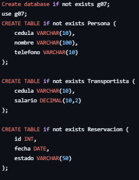
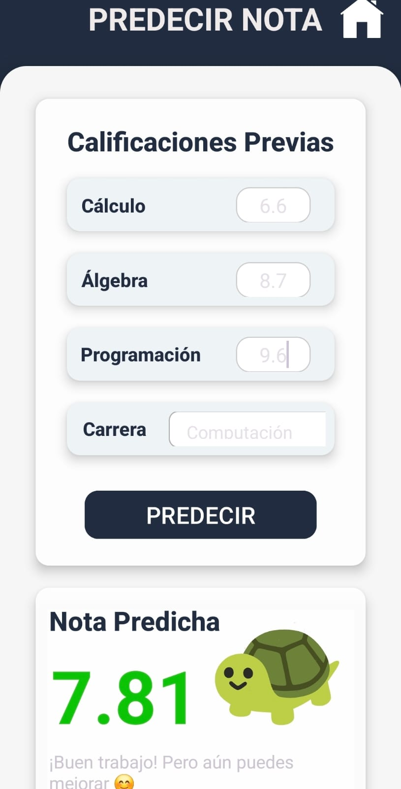

# Mi sitio personal 😄
Este es mi sitio personal. Aquí puedes encontrar información sobre mí, mis
proyectos y mis intereses.

## Contenido 📚
* [Información personal](#información-personal-) 
* [Proyectos](#proyectos-) 
* [Tecnologías aprendidas](#tecnologías-aprendidas-) 
* [Contacto](#contacto-)

## Información personal 🙋
* Nombre: Francisco Avendaño
* Ocupación: Estudiante de ESPOL - Ingeniería en Computación
* Sitio web: [GitHub](https://franciscoave.github.io/FranciscoAve/)

## Proyectos 💻
| Proyecto | Descripción | Vista previa |
| ----------- | ----------- | ----------- | 
| [Base De Datos - Empresa de Eventos](https://github.com/FranciscoAve/BasesDeDatos.git) | Proyecto académico donde se utilizaron conocimientos de ***SQL*** para poder simular una base de datos de una empresa de eventos |  |
| [Sistema de control de finanzas](https://github.com/CelsoCastro07/ProyectoPOO) | Colaborador en proyecto académico de un programa usando ***Java*** que permite al usuario el control de sus finanzas personales con interfaz amigable | |
| [Predicción nota estudiantil](https://github.com/leno-mpm/Proyecto-Estad-stica) | Colaborador en proyecto académico de Estadística donde, usando el ***lenguaje de programación R*** y mediante regresión lineal se predice la nota de la asignatura Estadística |  |

## Tecnologías aprendidas 🎯
He trabajado con distintos lenguajes, frameworks y herramientas:

He utilizado **Java y JavaFX** para desarrollar aplicaciones con interfaces gráficas.
**SQL** para modelar bases de datos relacionales.
**R y Python (con Pandas)** para análisis estadístico y de datos.  
Además de **Arduino IDE, C y Android Studio** para iniciarme en proyectos de hardware y aplicaciones móviles.

## Contacto 🔗
* **Correo:** favendan@espol.edu.ec
* **LinkedIn:** [www.linkedIn.com](https://www.linkedin.com/in/francisco-avenda%C3%B1o-valverde-6884b130b/)
